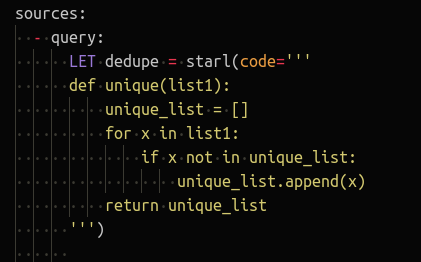
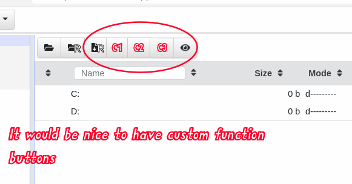

### 2021 Velociraptor Contributor Competition Entry:

**Author: justin<area>@project09851.com (@predictiple)**

# File Type Detection and Client-Server-Client Workflows

**Table of Contents**

* [Goals](#goals)
* [What we want Velociraptor to do](#what-we-want-velociraptor-to-do)
* [Step 0: Follow along on your own Velociraptor](#step-0-follow-along-on-your-own-velociraptor)
  * [Artifact: <a href="https://github.com/predictiple/VelociraptorCompetition/blob/main/artifacts/Temp.Setup.Demo.yaml">Temp.Setup.Demo</a>](#artifact-tempsetupdemo)
* [Step 1: Locate interesting files based on file magics (using Yara)](#step-1-locate-interesting-files-based-on-file-magics-using-yara)
  * [Artifact: <a href="https://github.com/predictiple/VelociraptorCompetition/blob/main/artifacts/Custom.Client.FindByMagics.yaml">Custom.Client.FindByMagics</a>](#artifact-customclientfindbymagics)
* [Step 2: Have Velociraptor server decide what the client should do next](#step-2-have-velociraptor-server-decide-what-the-client-should-do-next)
  * [Artifact: <a href="https://github.com/predictiple/VelociraptorCompetition/blob/main/artifacts/Custom.Server.DispatchTriage.yaml">Custom.Server.DispatchTriage</a>](#artifact-customserverdispatchtriage)
* [Step 3: Send new orders to the client](#step-3-send-new-orders-to-the-client)
  * [Artifact: <a href="https://github.com/predictiple/VelociraptorCompetition/blob/main/artifacts/Custom.Client.TriageGene.yaml">Custom.Client.TriageGene</a>](#artifact-customclienttriagegene)
  * [Artifact: <a href="https://github.com/predictiple/VelociraptorCompetition/blob/main/artifacts/Custom.Client.TriageCapa.yaml">Custom.Client.TriageCapa</a>](#artifact-customclienttriagecapa)
* [Step 4: Have Velociraptor server decide what the client should do next](#step-4-have-velociraptor-server-decide-what-the-client-should-do-next)
  * [Artifact: <a href="https://github.com/predictiple/VelociraptorCompetition/blob/main/artifacts/Custom.Server.DispatchUpload.yaml">Custom.Server.DispatchUpload</a>](#artifact-customserverdispatchupload)
* [Step 5: Send new orders to the client](#step-5-send-new-orders-to-the-client)
  * [Artifact: <a href="https://github.com/predictiple/VelociraptorCompetition/blob/main/artifacts/Custom.Client.TriageUpload.yaml">Custom.Client.TriageUpload</a>](#artifact-customclienttriageupload)
* [Step X: Bonus points: Hijacking the VFS browser upload function](#step-x-bonus-points-hijacking-the-vfs-browser-upload-function)
  * [Artifact: <a href="https://github.com/predictiple/VelociraptorCompetition/blob/main/artifacts/System.VFS.DownloadFile.yaml">System.VFS.DownloadFile</a>](#artifact-systemvfsdownloadfile)
* [Let's see it all in action!](#lets-see-it-all-in-action)
* [Conclusion](#conclusion)


***

Currently most Velociraptor artifacts are written in such a way that they are self-contained and are therefore mostly useful in a standalone manner.
In other words the common approach to artifact-writing tends to produce monolithic artifacts which typically have to:

1. do some kind of targeting logic
2. do something with the target files (if found)
3. do something with or about the results

The current approach results in a few downsides and inefficiencies:

* some artifacts end up being rather lengthy and difficult to understand at a glance.
* there is inevitably a lot of very similar or even duplicated logic across many artifacts.
* artifacts are heavily dependent of path specifications which makes them somewhat brittle and prone to missing filesystem targets which are not in the conventional locations. This also means that the current artifacts are mainly suited to the use case of "online" data due to the the heavy reliance on path specifications. Thus many Velociraptor artifacts (without modification) are usable only on "live/online" endpoints and will not work against "offline" data, for example data which has been collected through disk imaging or other collection methods.

## Goals

1. The first goal of this demonstration is to show that Velociraptor artifacts can implement client-server-client workflow automation, with decision logic being driven by the server-side in order to achieve a more dynamic/flexible and modular system of DFIR data collection. This also shows that Velociraptor can support reasonably complex workflows implemented _using only VQL_, rather than having to implement decision logic in an external application that interfaces via the Velociraptor API.\
\
In a nutshell: client artifacts and server artifacts can dance together. Client artifacts don't have to do all the heavy lifting on their own. Server Monitoring artifacts are essentially server-based services that are an underutilised yet powerful component of Velociraptor.
<br/><br/>

2. The 2nd goal here is to demonstrate an approach that uses more concise and reusable Velociraptor artifacts. This is accomplished in 3 ways:\
\
  a. by creating artifacts that each do a very specific thing, i.e. functional simplification which also increases reusability.\
\
  b. by shifting some processing logic to the server side. In this way the processing logic can be spread across multiple artifacts.\
\
  c. through use of Velociraptor features in the artifact definition and in the VQL plugins set which directly facilitate code reuse, mainly these ones:

* *the Artifact() plugin*\
\
This allows Velociraptor artifacts to call other artifacts... which can then call other artifacts... and so on. With some careful planning this allows us to construct artifacts with branching logic to other (reusable) artifacts. This plugin also allows us to call a series of artifacts from one parent artifact, and perhaps have several layers of artifacts below the child artifact. This arrangement of logically related artifacts can amount to a sort of "playbook" where artifacts are invoked automatically rather than being run independently and manually.\
\
Recently it [became possible](https://github.com/Velocidex/velociraptor/issues/1235#issuecomment-915721425) to use preconditions in artifacts that are called by other artifacts. This allows us to have artifacts that can adapt themselves to their environment or the data. In this demo we use that approach to have unified triage artifacts that will run equally well on Windows, Mac and Linux.
\
* *export/imports*\
\
This [relatively new](https://github.com/Velocidex/velociraptor/pull/1087) feature allows artifacts to share blocks of code, including VQL, with other artifacts. Some of the current bundled artifacts are overloaded with huge reference lists and signature definitions. Artifacts such as these could benefit by having their weighty reference components allocated to dedicated artifacts which don't have any VQL queries. These artifacts would then significantly cut down the size of some existing artifacts and again it is something that facilitates code-sharing across artifacts.
<br/><br/>

3. The 3rd goal is to demonstrate that artifacts can be easily created to support multiple platforms, as mentioned above. Although this demonstration targets Windows files it does not require that the processing be done _on_ a Windows system. That means that it can also be used for "offline" processing of Windows files collected via external mechanisms (for example Kroll's KAPE collection tool or disk images).
<br/><br/>

4. The 4th goal is to demonstrate a setup artifact that loads artifacts, tools and server monitoring tasks in 2 easy steps.
<br/><br/>

5. The 5th goal is to show that RawSec GENE is an excellent evtx triaging/analysis tool. I hope that more DFIR people start using it and support the tool's author, [Quentin Jerome](https://github.com/qjerome), who has put years into it's development and it's sibling open-source DFIR tools that are very much under-appreciated.
<br/><br/>

***

## What we want Velociraptor to do


* Locate `evtx` and `exe` files on the **client** based on file magic [("magic bytes")](https://www.netspi.com/blog/technical/web-application-penetration-testing/magic-bytes-identifying-common-file-formats-at-a-glance/?print=print) using Yara rather than using explicit file paths or file names.
  * Artifact: `Custom.Client.FindByMagics`
* Have the Velociraptor **server** create a client-side flow to run [GENE](https://github.com/0xrawsec/gene) analysis against each `evtx` file.
* Have the Velociraptor **server** create a client-side flow to run [CAPA](https://github.com/fireeye/capa) analysis against each executable (`pe32`) file.
  * Artifact: `Custom.Server.DispatchTriage`
  * Artifact: `Custom.Client.TriageGene`
  * Artifact: `Custom.Client.TriageCapa`
* Have the **server** interpret the results and create more client-side flows to do something else in response to the triaging artifacts' results. Perhaps upload these specific files back to the server to preserve evidence contained in them.
  * Artifact: `Custom.Server.DispatchUpload`
  * Artifact: `Custom.Client.TriageUpload`

* Bonus points: Hijacking the VFS browser "upload" function to allow us to kick off the above workflow from the VFS browser. :cowboy_hat_face:
  * Artifact: `System.VFS.DownloadFile`

In a nutshell:\
_**we want to run a single artifact and then let Velociraptor decide what the next steps should be... and then iterate that process**_

Although this is a simplified and somewhat contrived example, it aims to demonstrate concepts rather than being a comprehensive realworld solution. It provides an example that can be expanded upon and repurposed quite easily.

***

## Step 0: Follow along on your own Velociraptor

### Artifact: [`Temp.Setup.Demo`](https://github.com/predictiple/VelociraptorCompetition/blob/main/artifacts/Temp.Setup.Demo.yaml)

You can try this all on your own Velociraptor. You don't have to do this but you might like to see it in action on your own server. _It's probably not best to do this on a production server_, So if you don't have a test server you can instantly set one up by running a local-mode Velociraptor (which is both the server and client) with the following command:

```shell
velociraptor-v0.6.1-windows-amd64.exe gui
```

> Note: Please use the latest version: 0.6.1

There are a few simple steps to get the artifacts and tools set up on your server:

1. First step is to add the demo setup artifact - `Temp.Setup.Demo` - to your server's artifact repository.\
To do that run this VQL in a Velociraptor notebook:

```sql
SELECT artifact_set(prefix="Temp.", definition=Content) AS LoadReponse FROM http_client(url="https://raw.githubusercontent.com/predictiple/VelociraptorCompetition/main/artifacts/Temp.Setup.Demo.yaml")
```
The result should looks something like this:


2. Then run the demo artifact which will:

* install the other artifacts
* download the tools to your server's inventory, and
* load the server monitoring artifacts.

Run this VQL this in a Velociraptor notebook to run the artifact (be aware that this one may take a minute or two because it downloads the tool binaries to your server):

```sql
SELECT * from Artifact.Temp.Setup.Demo()
```
The result should looks something like this (and the red text does not mean anything went wrong - it's just logging information... in red :shrug:):


After it completes you can check that all the tools are loaded into the inventory by running this VQL query in a notebook:

```sql
SELECT * FROM inventory() WHERE name =~ 'gene' OR name =~ 'capa'
```

The tools in this repo are all the latest release versions from the author's repositories. I have just unzipped and renamed them for convenience, but they can be downloaded from the original repos if you're paranoid:

* GENE binaries: https://github.com/0xrawsec/gene
* GENE rules: https://github.com/0xrawsec/gene-rules/blob/master/compiled.gen
* CAPA binaries: https://github.com/fireeye/capa

> **For testing purposes you can also download some evtx files from [here](https://github.com/sans-blue-team/DeepBlueCLI) which contain events from simulated malicious activity.**

Now we're ready to go!\
_Поехали!_

***

## Step 1: Locate interesting files based on file magics (using Yara)

### Artifact: [`Custom.Client.FindByMagics`](https://github.com/predictiple/VelociraptorCompetition/blob/main/artifacts/Custom.Client.FindByMagics.yaml)


Our first adventure is locating files of interest without explicity telling Velociraptor their locations or file names.

Sure we know that evtx files are supposed to all be in C:\Windows\System32\winevt\logs\, but imagine a scenario that a server admin may have diligently saved some evtx files to his desktop while troubleshooting some unrelated issue 2 weeks ago, long before anyone even suspected that the server was compromised. Upon investigating you find that the server's logs retain only about 2 days worth of events, making those saved logs on the admin's desktop _extreeemely valuable!_ Of course _you wouldn't know_ that the admin fortuitously did that and _he may not know_ that there's a security incident going on or that you even exist! So finding evidence in unexpected places can be pretty important. In this hypothetical scenario we could find these unexpected files using the fact that Windows evtx files have a known file magic: `ElfFile`. Such file magics (signatures) can easily be identified using Velociraptor's built-in Yara plugin and we'll use that fact in this demonstration.

For other files where the file magic is insufficient to identify the exact type of data - for example text logs which are all text and don't have any file magic (although there are indirect ways to solve that problem) - we can do a deeper dive into the file content using additional Yara scans as another layer in the identification process, and thus resolve ambiguous file types into specific data types. In this way we can resolve more than just basic file magics: we can extend the concept to a more precise level of resolution which we can call "data types". For example, we can disamgiguate text logs into the specific data types of "Apache access log" vs. "Apache error log" vs. "Windows Defender log" using deeper levels of inspection. And we can do this without needing to know their file paths or file names! Awesome!

But for the purpose of keeping this demonstration as concise as possible we will only be dealing with evtx and exe files which are reliably and unambiguously identifiable using just file magics. Extending the identification to data types is an exercise left to the reader :smiley: (and yes, this could also be done quite well with Velociraptor's amazing [parse_binary](https://docs.velociraptor.app/vql_reference/parsers/#parse_binary) function)

In addition to freeing us up from the annoying dependency on path specifications, this approach also allows us to target files that have had their file extension changed or removed. As mentioned previously, having our targeting done independent of file paths and/or file names allows us to deal with the "offline data" use case more easily. And as a bonus it also makes things relatively platform-independent.

> Note:\
More fancy filtering could be implemented but we're trying to keep it simple. The goal of this artifact is to identify relevant files and report back with their path. Subsequent artifacts could apply additional targeting logic based on things like timestamps or file content for example. In this case we are going to do more in-depth analysis with [GENE](https://github.com/0xrawsec/gene) and [CAPA](https://github.com/fireeye/capa) and use these tools to identify a subset of files that are more significant than the rest.
<br/><br/>


We have embedded the 2 Yara rules inside the artifact parameters, however if we needed to use a more extensive list of Yara rules then would be impractical to put them inside the artifact definition. In that situation there are several alternatives:
1. store the rules in a separate file that could be added to the Velociraptor tool inventory and treated as a non-executable tool.
2. host a rules file on a web server and retrieve it on the client using the `http_client()` function. 
3. store the rules in a dedicated artifact and export it using the [export/imports](https://github.com/Velocidex/velociraptor/pull/1087) feature. ~~This approach apparently doesn't work when the `exports` section is in an artifact which is being called from another artifact using the Artifacts plugin, so it would not work if we called `Custom.Client.FindByMagics` from `System.VFS.DownloadFile` via the VFS browser GUI. I should probably log an issue about that...~~ (note: this is fixed in [https://github.com/Velocidex/velociraptor/pull/1299](#1299), so it will be possible from v0.6.2). anyway for that reason we have just kept it simple and embedded the 2 rules as an artifact parameter.

***

## Step 2: Have Velociraptor server decide what the client should do next

### Artifact: [`Custom.Server.DispatchTriage`](https://github.com/predictiple/VelociraptorCompetition/blob/main/artifacts/Custom.Server.DispatchTriage.yaml)


The purpose of this artifact is to pair the files found by the FindByMagics artifact with the appropriate next step, i.e. the next artifact that needs to take action on the file. It's essentially a patchboard between incoming file magic types and outgoing Velociraptor artifacts.


This artifact runs as a server-side monitoring artifact and listens for flow completions of our `FindByMagics` artifact. It retrieves the monitored artifact's results and pairs each result with a follow-up artifact. It then dispatches the follow-up artifact to the client using the `client_collect()` VQL function. To avoid dispatching a new client flow for every input file it compiles the list of target files into a list (for each type and accessor) and then dispatches a single artifact and passes the list and accessor to the artifact.


In order to achieve deduplication of the list of targets we have used Velociraptor's `starl()` function which allows us to define a simple deduplicate function using Python code:



[https://github.com/google/starlark-go](Starlark) is a dialect of Python. We've used it here because Velociraptor doesn't currently have a function to deduplicate a list of values. So we've just given VQL a new capability, and it's very cool to be able to that "on the fly" through the `starl()` function.

To make things configurable we have used artifact parameters for the list of monitored artifacts as well as for the item-level input->output pairing ("Response Mapping"). So you can add or remove monitored artifacts very easily without changing the artifact's code.

You can also set up your own mappings of file magics -> response artifacts. One MagidID value can map to more than 1 dispatched artifact (one-to-many), so it is possible to have 2 or more types of analysis (via their own independent artifacts) run in response to a particular file type being identified. It's also possible to have multiple MagicID values map to the same dispatched artifact (many-to-one), for example if the dispatched artifact performed some format-independent function such as uploading the target files to the server.

## Step 3: Send new orders to the client

### Artifact: [`Custom.Client.TriageGene`](https://github.com/predictiple/VelociraptorCompetition/blob/main/artifacts/Custom.Client.TriageGene.yaml)

### Artifact: [`Custom.Client.TriageCapa`](https://github.com/predictiple/VelociraptorCompetition/blob/main/artifacts/Custom.Client.TriageCapa.yaml)

These artifacts are probably not as good as they could be, but their main purpose is to illustrate that more in-depth analysis can be scheduled on a client based on the results of a previously run artifact. This process can be iterative and involve branching logic.

The key things to notice about these artifacts are:

1. They are multi-platform. So they can be run on the 3 main operating systems without OS-specific targetting. They can also work on "offline" data, where files from 1 operating system are being processed on a different operating system.

2. The tool definitions ("tools" section of the artifact) are as simple as possible because we've already defined and initialised (incl. downloading) the tools during the setup process. The tool definitions here are just to ensure that these tools are available to this artifact.

3. We don't mess around with fancy-pants unzipping of tools in our artifact. Several of the Velociraptor-bundled artifacts download zipped tools from Github and then unzip them on the client. This is done for user-convenience but it creates unnecessary complexity in the artifact, plus we really shouldn't be using tools in zips that have been pulled straight from Github. It's better to download the tools, unzip the tools, test/validate the tools, and then store them in your Velociraptor's inventory. This approach also means that your endpoints don't need access to Github because all the tools will be pulled from the Velociraptor server.

4. We set the artifact parameters to "hidden" because we don't intend these artifacts to be used standalone.

5. We give them a generous timeout because we could be targetting a large set of files that were previously collected and are now being analysed "offline". Also Capa is written in Python and slow as molasses.
<br/><br/>

>Note: Windows Defender will probably prevent Capa from running. You may need to temporarily disable it's realtime protection option or else add a realtime scanning exclusion for the folder your testing on.

<br/><br/>

***

## Step 4: Have Velociraptor server decide what the client should do next

### Artifact: [`Custom.Server.DispatchUpload`](https://github.com/predictiple/VelociraptorCompetition/blob/main/artifacts/Custom.Server.DispatchUpload.yaml)

The triaging artifacts in the previous step have now looked at the target files in more depth and given some sort of risk-rating or assessment based on the information in (or about) each file.

Similarly to Step 2, the server can now collate that information and conditionally dispatch another artifact to the client. The artifact is almost identical to the one described in Step 2 other than for the fact that it's now using `criticality_score` in the decision process instead of `magic_id`.


The client artifact we will dispatch here is `Custom.Server.DispatchUpload`, which is described in the next step.

***

## Step 5: Send new orders to the client

### Artifact: [`Custom.Client.TriageUpload`](https://github.com/predictiple/VelociraptorCompetition/blob/main/artifacts/Custom.Client.TriageUpload.yaml)

This artifact is a simple one that just uploads the files identified by the previous steps as containing relevant information.

In other words, what we have accomplished is **the preservation of evidence based on the actual evidence contained within the files themselves**. This is a better approach than just uploading everything and _then_ checking to see what the files contain.

***

## Step X: Bonus points: Hijacking the VFS browser upload function

### Artifact: [`System.VFS.DownloadFile`](https://github.com/predictiple/VelociraptorCompetition/blob/main/artifacts/System.VFS.DownloadFile.yaml)


Under the hood Velociraptor itself uses many artifacts that contain VQL for performing various functions, including many of the functions exposed via the Velociraptor GUI. The VFS (Virtual File System) browser in the GUI has an associated artifact named `System.VFS.DownloadFile` (https://github.com/Velocidex/velociraptor/blob/54d878fd57a9250b44965429750a4d20e7850b3e/artifacts/definitions/System/VFS/DownloadFile.yaml)

This artifact provides 2 functions which are invoked by 2 buttons in the VFS GUI:
* "download_one_file"
* "download_recursive"

We would like to be able to browse around on the client machine and when we find an interesting folder we want to be able to click a button and let Velociraptor do the rest! To do that we are going to have to hijack one of those buttons. The "Download Recursive" button and corresponding VQL artifact's function seems to be the best match for our purposes since we want to target a folder and do stuff recursively with the files in that folder.

> NOTE: It sucks that we need to hijack a built-in "system" artifact to do this, and we feel really bad about doing it (well not really), but at present there are no "custom function" buttons available in the VFS browser GUI. So for now we do this with full knowledge that it is frowned upon and that we are subverting functionality which may be needed for other purposes. 



In the `System.VFS.DownloadFile` artifact we've replaced the `download_recursive` function with our own one that runs our `Custom.Client.FindByMagics` artifact and pass the parameters `Path` and `Accessor` to it. With that minimal information the FindByMagics artifact can begin it's work. Thus we have replaced the native function and by extension we have hijacked the "Download Recursive" button in the VFS browser. Neat!


We also added the 1-hour timeout into the artifact so that it's behaviour is consistent with the timeout of the `Custom.Client.FindByMagics` artifact. Finding files can take a long time, so this is just to avoid frustrating timeouts - however it should rarely take anything as long as an hour.


***

## Let's see it all in action!

Starting from the `Custom.Client.FindByMagics` artifact:


Starting from the VFS browser:


(p.s. sorry my gif recording software caught some jitter)

***

## Conclusion

So what we have here is a set of artifacts that work together to implement a simple workflow. We run a single artifact and all we give it is a filesystem path where it should start looking for stuff. With the VFS browser hack we can even simplify that a bit more and reduce it to just browing around and clicking a button. We can even browse around the Volume Shadow Copies and target these and other sneaky hidden files. Velociraptor then finds relevant stuff and decides what to do with that stuff.

Although this is a simplified example the concepts can be applied to much more creative artifacts in order to produce quite complex workflows. We hope you'll find this useful and apply your own creativity in creating cleverer workflows that do super-awesome things!

Have fun guys!!!
